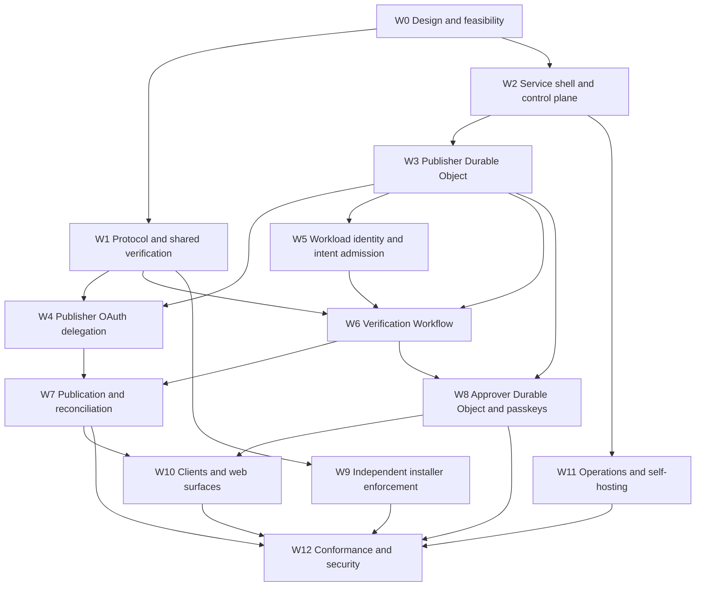

# Delegated release service implementation plan

Status: Implemented locally; PR review and deployment conformance pending

Companion specification: [Delegated release service](./delegated-release-service.md)

Related design: [RFC PR #1870](https://github.com/emdash-cms/emdash/pull/1870)

## Outcome

This plan delivers a hosted and self-hostable delegated release service in reviewable increments. A GitHub Actions workflow can publish an attested sandboxed-plugin release through a publisher's exact create-only AT Protocol delegation. Invalid output remains un-installable because EmDash independently repeats verification. Releases that expand declared access or use `confirmation: always` require a profile-authorized, user-verified passkey decision.

Canonical service state is sharded by publisher or approver DID in SQLite-backed Durable Objects. Workflows coordinate long-running work. A 256-shard identity-directory Durable Object projection supports fleet enumeration and never participates in authorization.

## Existing implementation baseline

The implementation starts from current `main`, not from the #1908 integration branch.

### Available on `main`

- `@emdash-cms/registry-lexicons` exports the active package/profile records and `getDelegatedReleasePermission()`.
- `@emdash-cms/plugin-types` provides manifest validation, declared-access canonicalization, comparison, and escalation detection.
- `@emdash-cms/registry-verification` provides guarded resource fetching, multihash verification, canonical bundle validation, record/policy verification, and GitHub Sigstore/SLSA verification in Node and workerd.
- The registry client and plugin CLI already have AT Protocol publishing and credential foundations.

### Donor material on #1908

The old branch contains reviewed or tested implementations for:

- required-user-verification WebAuthn primitives;
- confidential OAuth metadata and storage experiments;
- compact JOSE envelope encryption;
- GitHub Actions OIDC verification;
- service API response and request-security foundations;
- an isolated verifier Worker; and
- create-only publishing and installer-verification prototypes.

Each donor unit must be compared with current `main`, the accepted specification, and current platform APIs. Port bounded commits or code paths with provenance. Do not merge, rebase, or cherry-pick the whole integration branch.

### Superseded assumptions

The new implementation does not retain:

- D1 as canonical service state;
- D1 coordination leases;
- a D1 transactional outbox as the release lifecycle;
- AT Protocol login for service operators;
- one large publisher/operator console;
- Queue-plus-cron orchestration for release intents; or
- aggregator historical-policy enforcement as a prerequisite for the first service release.

### Current execution state

The replacement implementation is complete in a seven-layer local `gh-stack`. It includes confidential OAuth custody, sharded publisher and approver authority, GitHub Actions admission, verification and publication Workflows, independent installer enforcement, passkey approval, Access operator controls, product UIs, encrypted archive/restore, encryption-key lifecycle, abuse limits, observability, self-hosting documentation, and browser conformance.

No replacement pull request is opened until the complete local stack passes its formatting, typecheck, package, Worker, browser, generated-binding, and changeset gates. The seven branches form one merge unit and do not represent deployable intermediate service versions.

The public-client G0 lifecycle is complete on both providers: exact-scope authorization, forced refresh, and server revocation passed. npmX rejected its access token immediately after revocation. Cirrus retained the already-issued access token for its remaining lifetime while preventing future refresh. G0 still requires the deployed confidential-client run and client-key removal observation before either provider is advertised as supported by the hosted service.

Closed PR #1908 remains donor history and is not a merge target. Its D1 custody and coordination model does not satisfy this plan. Draft PR #1909 is the independent metadata-labeling service and does not join the delegated-release service stack.

## Execution rules

- The companion specification is the source of truth. A workstream may refine an implementation detail but cannot weaken a security invariant.
- Complete failing behavior tests with each implementation. Security and failure tests are not deferred to the conformance workstream.
- Keep publisher, approver, operator, and CI authentication realms separate in types, middleware, cookies, and routes.
- Keep canonical authorization state in Durable Objects. A projection or Workflow result cannot authorize a transition.
- Use Durable Object RPC for typed state operations. Do not hold `blockConcurrencyWhile()` across external I/O.
- Every external side effect has a generation-bound operation token, idempotency identity, or deterministic reconciliation path before it is enabled.
- Keep incomplete authority paths unreachable. A feature flag or undocumented route is not a sufficient boundary.
- Put package and root-workspace changes in a designated integration worktree. Parallel worktrees do not all edit `pnpm-lock.yaml`, root `package.json`, CI, or generated binding types.
- Represent every dependent PR lane as a GitHub stack managed with `gh-stack`. Independent workstreams use separate stacks rooted on `main`.
- Treat each GitHub stack as one merge unit. Its branches are review boundaries, not deployable service versions. A partial stack merge requires an explicit integration gate that is independently usable.
- Before the first service deployment, define the complete initial schema and persisted formats on their owning lowest branches. Do not add migrations or legacy readers solely for intermediate branches in an unmerged stack. After the first deployment, every persisted-state change uses a forward-only migration and preserves deployed data.
- Merging an implementation stack does not authorize a deployment. The first hosted or self-hosted release waits for the complete service and its G7 production gate.
- New public records and fields remain additive while experimental.
- User-facing application strings use Lingui and RTL-safe layouts. The Access operator console follows the same UI quality rules even though its deployment audience is small.
- Each published-package change includes a reviewed changeset.

## Workstream dependency graph



The service critical path is:

```text
W0 -> W1 -> W2 -> W3 -> W4/W5 -> W6 -> W7 -> W9/W12
```

Approval and product surfaces follow a parallel path after the publisher object contract stabilizes:

```text
W3 -> W8 -> W10 -> W12
```

## Integration gates

| Gate                            | Required evidence                                                                                                                            | Unblocks                                           |
| ------------------------------- | -------------------------------------------------------------------------------------------------------------------------------------------- | -------------------------------------------------- |
| **G0 Design**                   | RFC decisions reconciled; exact create-only scope proved on every claimed PDS; no broad fallback                                             | Authority-bearing implementation                   |
| **G1 Contracts**                | Lexicons, direct-PDS reads, shared record/bundle/provenance reports, and fixtures pass in Node and workerd                                   | Service Workflow and installer work                |
| **G2 Durable state**            | Service shell, Access auth, control object, publisher object, initial schema, state machine, idempotency, and alarms pass real workerd tests | OAuth, OIDC, Workflow integration                  |
| **G3 Automatic vertical slice** | Controlled GitHub workflow publishes one valid non-escalating release and converges under retries                                            | Independent enforcement and private service trials |
| **G4 Independent enforcement**  | A clean EmDash site accepts valid output and rejects every invalid service-output fixture                                                    | Hosted limited beta                                |
| **G5 Approval**                 | `always` and escalation releases require a valid current approver and passkey; every invalidation path re-approves                           | Broader publisher beta                             |
| **G6 Operational beta**         | Pause, suspension, revocation, reconciliation, key rotation, backup/export, alerts, and self-host path work without database edits           | Public beta                                        |
| **G7 Production**               | End-to-end conformance, recovery drills, and external security review have no unresolved critical/high findings                              | Production launch                                  |

## W0 Design and feasibility

Owner surface: RFC, external validation, retained conformance fixtures.

Dependencies: none.

### Tasks

| Task   | Work                                                                                                                                                      |
| ------ | --------------------------------------------------------------------------------------------------------------------------------------------------------- |
| `W0.1` | Reconcile RFC #1870 with the Durable Object architecture, Access operator authentication, existing `emdash-plugin` command, and active experimental NSIDs |
| `W0.2` | Freeze the first-release profile policy, provenance, workload policy, approval digest, intent state, and error contracts                                  |
| `W0.3` | Validate the exact create-only grant against the available npmX-hosted Bluesky PDS and Cirrus test accounts                                               |
| `W0.4` | Validate confidential OAuth refresh, DPoP behavior, revocation, and client-key rotation with real authorization servers                                   |
| `W0.5` | Confirm current Workflow event, retention, retry, and test APIs support approval and recovery; record limits outside the protocol contract                |
| `W0.6` | Define hosted-service Access audience and group-to-role mapping and the self-host configuration contract                                                  |

### Acceptance criteria

- Every public contract has one normative shape and owner.
- The exact scope creates a release and cannot update, delete, edit a profile, or write another collection on the Bluesky PDS implementation at npmX and on Cirrus.
- Refresh and revocation observations are recorded with reproducible external steps.
- An unsupported PDS is excluded from the support matrix instead of receiving a broader scope.
- The Workflow design has a tested route for approval, rejection, cancellation, timeout, retry, and lost-instance recovery.
- The RFC and technical specification contain no contradictory actor names, CLI commands, or trust claims.

### Parallelism

`W0.3`, `W0.4`, `W0.5`, and `W0.6` can run in separate research tasks. Only `W0.1` edits the RFC. Research tasks return concise evidence to the coordinator rather than landing prototype applications or unrelated dependencies.

## W1 Protocol and shared verification

Owner surface:

- `packages/registry-lexicons/`
- `packages/registry-verification/`
- `packages/registry-client/src/direct-pds/`
- `packages/plugin-types/` only for shared declared-access behavior
- protocol fixtures under the owning packages

Dependencies: G0 contract decisions.

### Tasks

| Task   | Work                                                                                                                                        |
| ------ | ------------------------------------------------------------------------------------------------------------------------------------------- |
| `W1.1` | Audit profile/release lexicons and generated types against the accepted RFC; keep additions optional                                        |
| `W1.2` | Finalize the exact permission helper and create-only publishing client without update/delete escape hatches                                 |
| `W1.3` | Complete authoritative direct-PDS profile, release, list, and deterministic-key reads                                                       |
| `W1.4` | Produce one structured record/policy report covering normalized policy, profile CID, release CID, provenance status, and stable error codes |
| `W1.5` | Confirm canonical bundle/manifest and declared-access reports share one implementation across service and installer                         |
| `W1.6` | Expand real provenance fixtures for valid, missing, corrupt, substituted, foreign-source, wrong-builder, and unsupported predicates         |
| `W1.7` | Verify packed published output in Node and workerd and retain interop fixtures outside planning documents                                   |

### Acceptance criteria

- Existing publishing flows preserve unknown and known extensions.
- The create-only helper has no callable update or delete operation and rejects a mismatched collection.
- Direct-PDS reads fail with stable codes for DID, PDS, record, CID, lexicon, identity, and policy failures.
- The same fixtures produce equivalent reports in Node and workerd.
- Manifest access comparison detects every broadened category, operation, and recognized constraint.
- Unsupported supplied provenance fails as unverifiable rather than being treated as absent or valid.
- Installer and service can consume the same public report types without importing application code.

### Parallelism

Split into at most two worktrees after `W1.1` freezes types:

- direct-PDS and record-policy verification (`W1.2` to `W1.4`);
- provenance and packed-output fixtures (`W1.5` to `W1.7`).

Both worktrees must avoid editing the same barrel files. The contracts worktree owns final exports and generated lexicons.

## W2 Service shell and control plane

Owner surface:

- `apps/release-service/package.json`
- `apps/release-service/wrangler.jsonc`
- `apps/release-service/src/index.ts`
- `apps/release-service/src/env.ts`
- `apps/release-service/src/api/`
- `apps/release-service/src/access/`
- `apps/release-service/src/control-do/`
- root workspace and CI integration for the application

Dependencies: G0 architecture and Access decisions.

### Tasks

| Task   | Work                                                                                                                                                               |
| ------ | ------------------------------------------------------------------------------------------------------------------------------------------------------------------ |
| `W2.1` | Scaffold the Worker, static assets, test configuration, bindings, Wrangler Durable Object class migration, Workflow binding, verifier binding, and generated types |
| `W2.2` | Add versioned JSON envelopes, request IDs, body limits, security headers, CORS policy, error handling, and route composition                                       |
| `W2.3` | Implement Access JWT verification, role-specific audience boundaries, CSRF, and operator mutation idempotency                                                      |
| `W2.4` | Implement `ServiceControlDurableObject`, service modes, publication permits, publisher controls, audit, and alarm-backed cleanup                                   |
| `W2.5` | Add health and readiness behavior that distinguishes configuration, binding, and dependency failure without exposing tenant state                                  |
| `W2.6` | Add CI lanes for Node tests, workerd tests, Worker build, binding generation, and packed-output checks                                                             |

### Acceptance criteria

- Production routes start only with complete required bindings and fail with public-safe configuration errors.
- Access operator routes reject missing, wrong-audience, expired, malformed, non-human, and wrong-role JWTs.
- Operator role boundaries prevent viewers and reviewers from executing admin-only actions.
- CSRF and idempotency checks apply to every cookie-authenticated mutation.
- Service mode transitions are atomic and append audit before returning success.
- A fresh publication permit reflects the latest service mode and cannot be reused after the mode epoch changes.
- Worker and Durable Object tests run against the real workerd runtime.

### Parallelism

`W2.2` API foundations and `W2.3` Access authentication may run in parallel after `W2.1` lands. `W2.4` owns the control-object schema and must not share its directory with either task. One integration owner updates root workspace files, CI, `wrangler.jsonc`, and generated binding types.

## W3 Publisher Durable Object

Owner surface:

- `apps/release-service/src/publisher-do/`
- publisher-shard schema and test fixtures
- publisher RPC types exported from one package-local entry point

Dependencies: W2.1 and shared state/error contracts.

### Tasks

| Task   | Work                                                                                                                                                                                   |
| ------ | -------------------------------------------------------------------------------------------------------------------------------------------------------------------------------------- |
| `W3.1` | Implement the complete initial object schema with `publisher`, `delegations`, `workload_policies`, `intents`, reservations, transitions, operations, audit, idempotency, and deadlines |
| `W3.2` | Implement the complete intent state machine with expected-state and generation guards                                                                                                  |
| `W3.3` | Implement package/version reservation and OIDC/request idempotency semantics                                                                                                           |
| `W3.4` | Implement generation-bound refresh and publication operation tokens without external I/O inside transactions                                                                           |
| `W3.5` | Implement append-only audit and public/private serializers                                                                                                                             |
| `W3.6` | Implement one-alarm deadline queue for operation recovery, intent expiry, session cleanup, and audit/snapshot scheduling                                                               |
| `W3.7` | Implement publisher session epoch and publisher/service suspension checks                                                                                                              |

### Acceptance criteria

- `getByName(canonicalPublisherDid)` routes every package for one publisher to the same object.
- Schema initialization is idempotent across object restarts.
- Illegal state transitions and stale generations cannot change state.
- Concurrent package/version reservations yield one owner and deterministic results for every loser.
- Exact idempotent replay returns the stored intent; conflicting replay returns `IDEMPOTENCY_CONFLICT`.
- Only the current operation token can complete refresh or publication.
- Alarm recovery marks abandoned operations for reconciliation without losing the next scheduled deadline.
- No RPC holds `blockConcurrencyWhile()` while calling another service or the network.

### Parallelism

The schema/state-machine task (`W3.1` and `W3.2`) lands first. Reservations/idempotency (`W3.3`), operations (`W3.4`), and serializers/audit (`W3.5`) can then run as stacked child branches with non-overlapping modules. Alarm and suspension integration (`W3.6` and `W3.7`) follows those contracts.

## W4 Publisher OAuth delegation

Owner surface:

- `apps/release-service/src/oauth/`
- `apps/release-service/src/crypto/`
- publisher identity/session routes
- publisher delegation RPC adapter

Dependencies: W1 exact permission, W2 API, W3 delegation and operation RPCs.

### Tasks

| Task   | Work                                                                                                              |
| ------ | ----------------------------------------------------------------------------------------------------------------- |
| `W4.1` | Implement confidential-client metadata, versioned JWKS, PKCE/state/nonce transactions, and callback validation    |
| `W4.2` | Implement identity-only publisher login and short-lived publisher application sessions                            |
| `W4.3` | Implement exact-scope delegation authorization and returned-grant validation                                      |
| `W4.4` | Implement and review compact JWE with `jose`, wrapped per-value content keys, and publisher/field context binding |
| `W4.5` | Persist encrypted sessions in the publisher object and implement serialized refresh using operation tokens        |
| `W4.6` | Implement publisher and operator revocation, client-key rotation, reauthorization, and failure classification     |

### Acceptance criteria

- OAuth state, PKCE, nonce, redirect URI, issuer, subject, and scope mismatches fail closed.
- Identity login does not leave a durable PDS write session.
- Delegation accepts only the exact active collection/create scope.
- Ciphertext copied to another publisher, table, row, or field cannot decrypt.
- Concurrent refresh attempts produce one accepted session generation and discard stale results.
- Revoked or unrefreshable authority blocks new publication and requests publisher reauthorization.
- Logs, errors, audit, fixtures, and snapshots contain no plaintext token or DPoP key.

### Parallelism

OAuth protocol (`W4.1` to `W4.3`) and encryption (`W4.4`) can run in parallel. Integration with publisher storage (`W4.5`) starts after both land. Revocation/rotation (`W4.6`) follows the integrated path.

## W5 Workload identity and intent admission

Owner surface:

- `apps/release-service/src/workload/`
- `apps/release-service/src/intents/admission/`
- GitHub OIDC fixtures
- workload-policy publisher routes

Dependencies: W2 API, W3 workload/idempotency RPCs, frozen W1 repository canonicalization.

### Tasks

| Task   | Work                                                                                                                                          |
| ------ | --------------------------------------------------------------------------------------------------------------------------------------------- |
| `W5.1` | Define issuer-neutral verified-workload types and error codes                                                                                 |
| `W5.2` | Implement GitHub issuer/JWKS verification and audience, expiry, repository, workflow, ref, environment, run ID, and run-attempt normalization |
| `W5.3` | Implement publisher-authorized workload-policy create, replace, disable, and audit operations                                                 |
| `W5.4` | Implement intent request schema, token disposal, request digest, service/publisher admission, reservation, and Workflow start                 |
| `W5.5` | Implement OIDC-authenticated intent status and cancellation using fresh matching workload identity                                            |
| `W5.6` | Add dry-run admission that validates OIDC and policy without reserving or publishing a version                                                |

### Acceptance criteria

- A valid configured GitHub workflow creates one intent and Workflow instance.
- Wrong issuer, signature, audience, expiry, repository, workflow, ref, environment, run identity, or inactive policy fails with a stable code.
- The raw OIDC token is absent from storage, logs, audit, Workflow parameters, and errors.
- Repeated identical submission returns the original intent; changed payload under the same identity fails.
- A paused or suspended publisher cannot create an intent.
- Cancellation is valid only before publication and requires matching workload identity or publisher ownership.
- Dry-run cannot reserve a version or create a publication operation.

### Parallelism

OIDC verification (`W5.1` and `W5.2`) and workload-policy CRUD (`W5.3`) can run in parallel after their interfaces freeze. Admission (`W5.4`) combines them. Status/cancel and dry-run can run as separate child tasks afterward.

## W6 Verification Workflow and isolated verifier

Owner surface:

- `apps/release-service/src/workflows/`
- `apps/release-service/src/verification/`
- `apps/release-verifier/`
- Workflow fixtures and introspection tests

Dependencies: G1, W3 intent RPCs, W5 admitted intents.

### Tasks

| Task   | Work                                                                                                                                                  |
| ------ | ----------------------------------------------------------------------------------------------------------------------------------------------------- |
| `W6.1` | Scaffold the verifier Worker with only the required egress/config bindings and shared-verification dependencies                                       |
| `W6.2` | Implement bounded artifact and provenance verification reports over the service binding                                                               |
| `W6.3` | Implement Workflow steps for authoritative profile, release-key absence, access baseline, artifact, provenance, workload binding, and policy decision |
| `W6.4` | Persist every step result through the publisher object and make static step names replay-safe                                                         |
| `W6.5` | Implement `awaiting_approval`, decision event, cancellation event, timeout, and expiry behavior                                                       |
| `W6.6` | Implement lost/expired Workflow recovery from authoritative intent and audit state                                                                    |

### Acceptance criteria

- The verifier has no publisher OAuth, Access, Durable Object, or service-control authority.
- SSRF, redirect, DNS rebinding, unsupported protocol, oversized, slow, and malformed-resource cases fail with bounded public-safe reports.
- Every verification input is tied to recorded profile CID, baseline CID, artifact checksum, provenance checksum, and workload claims.
- Workflow replay skips completed semantic work or receives the same idempotent result.
- A Workflow crash after any step resumes without duplicating an intent transition or external side effect.
- Approval timeout produces `expired`; rejection and cancellation cannot fall through to publication.
- Authoritative state is sufficient to restart recovery when Workflow instance data is unavailable.

### Parallelism

Verifier Worker (`W6.1` and `W6.2`) and Workflow state orchestration (`W6.3` skeleton and `W6.4`) can run in separate worktrees against agreed report/RPC interfaces. Approval waiting and recovery begin after the main Workflow path integrates.

## W7 Publication and reconciliation

Owner surface:

- `apps/release-service/src/publishing/`
- publication steps in the release Workflow
- create/reconcile PDS fixtures

Dependencies: W4 delegation, W6 verified intents, W2 service permits.

### Tasks

| Task   | Work                                                                                                                             |
| ------ | -------------------------------------------------------------------------------------------------------------------------------- |
| `W7.1` | Implement final re-fetch/reverification and invalidation of changed profile, baseline, artifact, provenance, workload, or policy |
| `W7.2` | Implement fresh service permit, publisher revocation check, publication operation token, and serialized session refresh          |
| `W7.3` | Implement deterministic create-only release publication                                                                          |
| `W7.4` | Implement exact-match, absence, conflict, and transient ambiguous-write reconciliation                                           |
| `W7.5` | Implement alarm/operator recovery and bounded retry policy                                                                       |
| `W7.6` | Emit terminal audit and optional projection events only after authoritative completion                                           |

### Acceptance criteria

- No release is written from stale verification or approval inputs.
- Pause, suspension, or delegation revocation immediately before the write blocks publication.
- Concurrent publication within one publisher produces one active operation token.
- A timeout before, during, or after `createRecord` converges without creating a second semantic release.
- Exact existing record is successful replay; different existing record is terminal conflict.
- Operator reconciliation cannot mark an absent or conflicting record as published.
- Published state records the authoritative AT URI and CID and is immutable.

### Parallelism

Final invalidation (`W7.1`) and PDS client/reconciliation fixtures (`W7.3` and `W7.4`) can run in parallel. Coordination (`W7.2`) and recovery (`W7.5`) must be reviewed together because they define the external-side-effect boundary.

## W8 Approver Durable Object and passkeys

Owner surface:

- `apps/release-service/src/approver-do/`
- `apps/release-service/src/approvals/`
- required-UV additions in `packages/auth/`
- approver OAuth and WebAuthn fixtures

Dependencies: W3 RPC conventions, W4 identity OAuth, W6 approval digest/event contract.

### Tasks

| Task   | Work                                                                                                                                       |
| ------ | ------------------------------------------------------------------------------------------------------------------------------------------ |
| `W8.1` | Port and review required-user-verification registration/authentication primitives in `@emdash-cms/auth`                                    |
| `W8.2` | Implement the complete initial approver-object schema, identity transactions, credentials, challenges, decisions, audit, and cleanup alarm |
| `W8.3` | Implement approver DID proof and short-lived approver sessions                                                                             |
| `W8.4` | Implement multiple named passkeys, counter handling, revocation, and credential-safe serializers                                           |
| `W8.5` | Define and compute the canonical approval digest and create single-use challenges                                                          |
| `W8.6` | Verify approve/reject assertions, return idempotent receipts, validate current profile membership, and deliver the Workflow event          |
| `W8.7` | Invalidate outstanding challenges on rejection, cancellation, expiry, digest change, or credential revocation                              |

### Acceptance criteria

- One approver DID routes to one object and can own multiple independently revocable credentials.
- Registration and authentication require user verification.
- OAuth identity must equal the DID named by the approver session and current profile.
- Challenges are random, digest-bound, single-use, origin/RP-bound, and expire.
- Cloned/counter-regressed, revoked, unknown, non-UV, wrong-origin, wrong-digest, replayed, and expired assertions fail closed.
- The same valid decision replay returns the same receipt; a conflicting decision under the same key fails.
- A stale approval receipt cannot authorize publication after any digest input changes.

### Parallelism

Shared auth primitives (`W8.1`) and object schema (`W8.2`) can run in parallel. DID/session integration (`W8.3`) and credential management (`W8.4`) follow the schema. Digest/decision integration (`W8.5` to `W8.7`) forms one stacked sequence.

## W9 Independent installer enforcement

Owner surface:

- `packages/core/src/api/handlers/registry.ts`
- registry install/update tests
- minimal admin provenance presentation only when required for consent
- query-count snapshots if behavior legitimately changes them

Dependencies: G1 shared verification. It can proceed independently of W2 to W8.

### Tasks

| Task   | Work                                                                                                           |
| ------ | -------------------------------------------------------------------------------------------------------------- |
| `W9.1` | Replace duplicate install verification with shared record, bundle, manifest, and provenance reports            |
| `W9.2` | Fetch authoritative profile/release records directly and evaluate current signed profile policy                |
| `W9.3` | Enforce required provenance and fail supplied invalid/unverifiable provenance regardless of policy default     |
| `W9.4` | Present provenance and policy status in install/update consent without trusting service or aggregator verdicts |
| `W9.5` | Add install/update conformance fixtures shared with service output                                             |

### Acceptance criteria

- The installer accepts a valid delegated release without contacting the release service.
- It rejects missing required provenance and every invalid/unverifiable supplied provenance case.
- It detects artifact, manifest, declared-access, package, version, source, builder, and record substitution.
- Aggregator envelope status and release-service state cannot change the verification result.
- Update performs the same checks and requires renewed capability consent when access broadens.
- No query is added to the logged-out public-render hot path.

### Parallelism

This is an independent stack after G1. Keep it separate from the service stack until shared report types stabilize, then rebase onto the merged contract PRs.

## W10 Clients and web surfaces

Owner surface:

- `packages/registry-client/src/release-service/`
- `packages/plugin-cli/`
- a new official GitHub Action package or action directory
- `apps/release-service/src/publisher-ui/`
- `apps/release-service/src/approver-ui/`
- `apps/release-service/src/admin-ui/`

Dependencies: stable APIs from W4 to W8 and W2 Access roles.

### Tasks

| Task    | Work                                                                                                             |
| ------- | ---------------------------------------------------------------------------------------------------------------- |
| `W10.1` | Add typed API client, polling, stable error mapping, and idempotency helpers                                     |
| `W10.2` | Build the official GitHub Action for OIDC, submission, status, approval URL, and terminal output                 |
| `W10.3` | Add CLI commands for delegate, revoke, workload policy, dry run, submit/status/cancel, enrol, and approve/reject |
| `W10.4` | Build publisher delegation, workload, intent, approver-status, and audit views                                   |
| `W10.5` | Build approval detail, declared-access diff, provenance/workload evidence, and passkey decision views            |
| `W10.6` | Build Access operator status, pause, publisher lookup, suspension, revocation, reconciliation, and audit views   |
| `W10.7` | Complete Lingui, accessibility, keyboard, responsive, and Arabic RTL coverage                                    |

### Acceptance criteria

- CI needs no static secret and prints stable intent/published outputs.
- CLI and web clients show the same state and error semantics.
- Publisher UI cannot access another publisher shard.
- Approval UI exposes enough immutable evidence to identify package, version, source, workflow, commit, artifact, provenance, policy, and access diff before passkey use.
- Operator UI cannot call publisher or approver mutation routes.
- All strings are localized and all layouts use logical direction-safe styling.
- Browser tests cover publisher OAuth, Access roles, passkey enrolment/approval, cancellation, pause, and reconciliation.

### Parallelism

After the API client lands, Action/CLI (`W10.2` and `W10.3`), publisher UI (`W10.4`), approver UI (`W10.5`), and operator UI (`W10.6`) can run in four independent worktrees because they own separate directories. Localization/accessibility completion follows each UI increment rather than waiting for `W10.7` as a cleanup PR.

## W11 Operations and self-hosting

Owner surface:

- `apps/release-service/src/directory/`
- `apps/release-service/src/backup/`
- operational metrics/logging modules
- deployment configuration and runbooks

Dependencies: W2 control plane and W3 publisher audit contract. Work can begin before publication is complete.

### Tasks

| Task    | Work                                                                                                                                      |
| ------- | ----------------------------------------------------------------------------------------------------------------------------------------- |
| `W11.1` | Implement a rebuildable 256-shard Durable Object identity directory containing only actor kind, DID, and timestamps                       |
| `W11.2` | Implement encrypted publisher snapshots and append-only audit exports to R2 with bounded resumable scheduling                             |
| `W11.3` | Implement encryption-key activation, background re-encryption, verification, retirement, and emergency rotation                           |
| `W11.4` | Add structured logs, metrics, alerts, health checks, correlation IDs, and privacy redaction                                               |
| `W11.5` | Add per-publisher, per-repository, and per-workload abuse/rate controls without a global request bottleneck                               |
| `W11.6` | Document and test Access, Durable Object, Workflow, verifier, Secrets Store, R2, Analytics Engine, and custom-domain self-host deployment |
| `W11.7` | Write incident, revocation, PDS outage, ambiguous write, key compromise, shard restore, Workflow loss, and rollback runbooks              |

### Acceptance criteria

- Deleting the identity directory does not change authorization or release state, and registrations rebuild the projection.
- Snapshot/export contains no plaintext secret and restore never revives revoked or expired authority automatically.
- Key rotation can stop, resume, and prove every retained ciphertext readable before retirement.
- Alerts cover publication pause, refresh failure, reconciliation backlog, shard migration failure, verifier failure, Access denial spikes, and audit/export gaps.
- Abuse controls cannot let one publisher exhaust or block another publisher shard.
- A fresh self-host deployment passes the same service conformance suite as the hosted service.
- Operators can execute every runbook without direct Durable Object SQLite edits.

### Parallelism

Directory work (`W11.1`), backup/key management (`W11.2` and `W11.3`), and observability/self-hosting (`W11.4` to `W11.7`) can run independently after the authoritative audit/event contract freezes. The directory remains non-authoritative and must not block the critical path.

## W12 Conformance and security

Owner surface:

- cross-package conformance fixtures
- workerd integration tests
- browser tests
- external test-PDS harness documentation
- security review closure

Dependencies: begins at G1 and expands after every gate.

### Tasks

| Task    | Work                                                                                                                                              |
| ------- | ------------------------------------------------------------------------------------------------------------------------------------------------- |
| `W12.1` | Maintain one fixture corpus for records, bundles, provenance, workload claims, policy, approvals, and public/private errors                       |
| `W12.2` | Build real workerd Durable Object and Workflow integration tests, including schema initialization, alarms, hibernation/restart, and retries       |
| `W12.3` | Build browser OAuth, Access, WebAuthn, CSRF, isolation, localization, and RTL tests                                                               |
| `W12.4` | Build controlled real-PDS and GitHub-OIDC end-to-end tests for hosted and self-host deployments                                                   |
| `W12.5` | Add adversarial and fault-injection tests for replay, concurrency, substitution, SSRF, token leakage, ambiguous writes, pause races, and key loss |
| `W12.6` | Run backup/restore, encryption rotation, Access compromise, delegation revocation, Workflow loss, PDS outage, and rollback drills                 |
| `W12.7` | Complete external security review and track closure by severity                                                                                   |

### Acceptance criteria

- Every security invariant has at least one test that fails when its enforcement is removed.
- Node and workerd share protocol fixtures but exercise their real runtime integrations.
- After the first deployment, each Durable Object schema change adds an upgrade test from retained deployed state.
- Fault injection at every external side-effect boundary converges to an allowed state.
- Browser tests prove authentication-realm and publisher isolation, not only successful navigation.
- Hosted and self-hosted end-to-end tests publish and independently install the same release.
- No unresolved critical/high external-review finding remains at production launch.

## Worktree and task strategy

Implementation is consolidated in one integration worktree and one seven-layer `gh-stack`. The complete stack must pass locally before any branch is pushed or any replacement PR is opened.

Each branch is a review boundary and may contain several focused commits. All seven branches merge as one unit, and no branch is a supported deployment target by itself.

### Consolidated seven-layer stack

| Layer | Branch                                   | Review scope                                                                   |
| ----- | ---------------------------------------- | ------------------------------------------------------------------------------ |
| 1     | `feat/drs-review-01-foundation`          | Worker shell, G0 harness, exact scope, OAuth metadata, encryption, and CI      |
| 2     | `feat/drs-review-02-authority-admission` | Publisher identity and custody, workload identity, intents, and admission      |
| 3     | `feat/drs-review-03-approvals`           | Required-UV passkeys, approver shards, and digest-bound decisions              |
| 4     | `feat/drs-review-04-verification`        | Isolated verification, authoritative records, installer trust, and consent     |
| 5     | `feat/drs-review-05-publication-product` | Access control, publication and reconciliation, clients, Action, CLI, and UI   |
| 6     | `feat/drs-review-06-operations`          | Directory, abuse controls, archive/restore, encryption operations, and runbook |
| 7     | `feat/drs-review-07-integration`         | Compatibility, browser conformance, product completion, specifications, and CI |

Lower-layer fixes are committed on the owning branch and cascaded with `gh stack rebase --upstack`. Do not amend or force-push an open PR except when a rebase requires replacing its branch history.

### Original workstream ownership

The following worktree names record the original parallel decomposition. They are retained to map the numbered acceptance criteria to their owning surfaces; they are not active branches or PRs.

| Lane            | Suggested worktree       | Suggested branch                 | Initial scope                                                 |
| --------------- | ------------------------ | -------------------------------- | ------------------------------------------------------------- |
| Coordinator     | `emdash-drs-integration` | `feat/drs-integration`           | Spec, dependency coordination, root workspace/CI, final gates |
| Feasibility     | `emdash-drs-w0`          | `docs/drs-feasibility`           | W0 evidence and RFC updates                                   |
| Contracts       | `emdash-drs-w1`          | `feat/drs-contracts`             | W1 packages and fixtures                                      |
| Platform        | `emdash-drs-w2`          | `feat/drs-platform`              | W2 app scaffold, bindings, Access, control object             |
| Publisher state | `emdash-drs-w3`          | `feat/drs-publisher-do`          | W3 publisher object only                                      |
| OAuth           | `emdash-drs-w4`          | `feat/drs-oauth`                 | W4 OAuth and encryption only                                  |
| Workload        | `emdash-drs-w5`          | `feat/drs-github-oidc`           | W5 OIDC, workload policy, admission                           |
| Verification    | `emdash-drs-w6`          | `feat/drs-verification-workflow` | W6 Workflow and verifier                                      |
| Publication     | `emdash-drs-w7`          | `feat/drs-publication`           | W7 PDS write/reconciliation                                   |
| Approval        | `emdash-drs-w8`          | `feat/drs-approval`              | W8 approver object/passkeys                                   |
| Installer       | `emdash-drs-w9`          | `feat/drs-installer-policy`      | W9 core install/update enforcement                            |
| Clients         | `emdash-drs-w10`         | `feat/drs-clients`               | W10 API client, Action, CLI, UIs split further as needed      |
| Operations      | `emdash-drs-w11`         | `feat/drs-operations`            | W11 projection, backup, observability, self-hosting           |
| Conformance     | `emdash-drs-w12`         | `test/drs-conformance`           | W12 shared cross-component tests                              |

These names describe logical slots, not permission to keep all worktrees active. Limit active implementation worktrees to the current execution wave.

### Original dependency lanes

The initial plan proposed the following independent stacks:

```text
Contract stack:
  main -> drs-contracts -> drs-record-verification

Service stack:
  main -> drs-platform -> drs-publisher-do -> drs-oauth
       -> drs-intent-workflow -> drs-publication

Approval stack:
  merged drs-publisher-do -> drs-approver-do -> drs-approval-integration

Consumer stack:
  merged drs-contracts -> drs-installer-policy

Operations stack:
  merged drs-platform/publisher audit contract -> drs-operations
```

The consolidated stack above replaces these lanes. They remain useful only for tracing each workstream's dependency direction.

### `gh-stack` PR workflow

Git worktrees own implementation branches. `gh-stack` owns the corresponding PR dependency graph and merge operation once branches reach the PR stage.

Before creating stacks, configure the repository for non-interactive operation:

```sh
git config rerere.enabled true
git config remote.pushDefault origin
```

The repository has multiple remotes, so every `gh stack` command that accepts a remote must pass `--remote origin` unless `remote.pushDefault` has already been verified.

Create each template-compliant PR with its explicit parent branch, then link the existing PRs into the local stack order:

1. Push each worktree branch explicitly.
2. Create its ready-for-review PR with the correct parent branch and a fully completed `.github/PULL_REQUEST_TEMPLATE.md` body.
3. Link the existing branch PRs into a stack from bottom to top.

For example, link the first layers after their PRs exist:

```sh
gh stack link --base main --remote origin \
	feat/drs-review-01-foundation \
	feat/drs-review-02-authority-admission \
	feat/drs-review-03-approvals
```

`gh stack link` finds the existing PRs, corrects their base branches, and creates or updates the GitHub stack without adding local stack state. Do not let it create a PR with an auto-generated body; every EmDash PR must use the repository template.

Use the non-interactive view command for status and automation:

```sh
gh stack view --json
```

Never run `gh stack view` without `--json`. Never run `gh stack checkout`, `gh stack init`, or `gh stack add` without an explicit target branch or PR. If a stack is checked out into a dedicated integration worktree, use `gh stack sync --remote origin` for routine parent rebases and `gh stack rebase --continue` or `--abort` for conflict recovery.

When review finds a lower-layer issue, fix it on the lower branch, then cascade the change upward. Do not place a protocol, schema, or API fix in a dependent UI or integration PR merely to avoid rebasing.

After every PR in a stack is ready and satisfies its gate, merge through `gh-stack`, not `gh pr merge`:

```sh
gh stack merge <stack-number> --yes --squash
```

Use the repository's selected merge method if it differs from squash. Stack merge is all-or-nothing unless the repository's merge queue processes the PRs separately. Review completion, PR size, or an intermediate branch passing CI does not justify a partial merge. Scope a partial merge to a PR number only when the plan defines that PR as an independently usable integration gate.

Do not add one branch to multiple stacks. When an independent stack needs a merged contract, rebase it onto updated `main`; do not share the contract branch between stacks.

### Retired foundation micro-stack

The first implementation used the following bottom-to-top branch chain:

```text
main
└── feat/drs-g0-conformance
    └── feat/drs-platform-oauth-metadata
        └── feat/drs-envelope-encryption
            └── feat/drs-publisher-do-oauth-custody
                └── feat/drs-publisher-refresh-operations
                    └── feat/drs-oauth-custody-adapter
                        └── feat/drs-publisher-application-sessions
                            └── feat/drs-confidential-oauth-callback
```

These PRs were closed and replaced by layers 1 and 2 of the consolidated stack. They remain donor history only.

### Retired Access and control micro-stack

The first implementation used this dependent chain:

```text
feat/drs-confidential-oauth-callback
└── feat/drs-access-auth
    └── feat/drs-service-control-do
        └── feat/drs-service-control-api
```

PRs #2649 to #2651 were closed and replaced by layer 5 of the consolidated stack.

### Retired workload identity micro-stack

PRs #2653, #2654, #2656, #2657, and #2658 were closed and replaced by layer 2. Their valid review findings are incorporated into the consolidated implementation.

### Retired verifier micro-stack

PRs #2659 and #2660 were closed and replaced by layer 4. The isolated verifier remains a separate Worker with no OAuth, Access, Durable Object, service-control, or secret bindings.

### Original planned stacks

| Stack                     | Bottom-to-top branches                                                                             | Merge gate                                       |
| ------------------------- | -------------------------------------------------------------------------------------------------- | ------------------------------------------------ |
| **Contracts**             | `feat/drs-contracts` -> `feat/drs-record-verification`                                             | G1                                               |
| **Platform state**        | `feat/drs-platform` -> `feat/drs-publisher-do` -> `feat/drs-publisher-operations`                  | G2                                               |
| **Publisher authority**   | `feat/drs-encryption` -> `feat/drs-oauth` -> `feat/drs-github-oidc` -> `feat/drs-intent-admission` | G2/G3 prerequisites                              |
| **Automatic publication** | `feat/drs-verifier` -> `feat/drs-verification-workflow` -> `feat/drs-publication`                  | G3                                               |
| **Independent consumer**  | `feat/drs-installer-policy`                                                                        | G4; independent stack rooted on merged contracts |
| **Approval**              | `feat/drs-required-uv` -> `feat/drs-approver-do` -> `feat/drs-approval-integration`                | G5                                               |
| **Clients**               | `feat/drs-api-client` -> `feat/drs-github-action` -> `feat/drs-cli`                                | G5/G6                                            |
| **Publisher UI**          | `feat/drs-publisher-ui` -> `feat/drs-approver-ui`                                                  | G5/G6                                            |
| **Operator UI**           | `feat/drs-operator-ui`                                                                             | G6; independent after Access APIs merge          |
| **Operations**            | `feat/drs-backup` -> `feat/drs-observability` -> `feat/drs-self-hosting`                           | G6                                               |
| **Conformance**           | `test/drs-conformance` -> `test/drs-recovery-drills`                                               | G7                                               |

The consolidated seven-layer stack supersedes this table.

### Worktree task brief

Every delegated task receives:

1. Objective and non-goals.
2. Exact base branch or parent PR.
3. Allowed file/directory ownership.
4. Interfaces it may consume and interfaces it may change.
5. Numbered acceptance criteria from this plan.
6. Required tests and commands.
7. Donor commits or files that may be consulted.
8. Explicit handoff artifacts: commits, test output, remaining risks, and migration notes.

If the task discovers a required change outside its file ownership, it reports the dependency to the coordinator or lower stack owner. It does not edit another active worktree's surface.

### Shared-file coordination

These files are serialized through the coordinator or named owner:

| Hotspot                                                          | Owner                                                |
| ---------------------------------------------------------------- | ---------------------------------------------------- |
| Root `package.json`, `pnpm-workspace.yaml`, and `pnpm-lock.yaml` | Coordinator                                          |
| `.github/workflows/ci.yml`                                       | Coordinator after workstream test commands are known |
| `apps/release-service/wrangler.jsonc` and generated Worker types | W2 platform owner                                    |
| Registry lexicons and generated types                            | W1 contract owner                                    |
| Package barrel exports                                           | Owning package's lowest stack branch                 |
| Companion specification and this plan                            | Coordinator                                          |
| Changeset consolidation                                          | Coordinator before final PR submission               |

The platform configuration declares the Durable Object, Workflow, verifier, R2, Secrets Store, Analytics Engine, and static-asset bindings used by the complete service. Generated Worker types must match that configuration.

### Parallel execution waves

#### Wave 0: decisions

Run in parallel:

- W0 exact-scope/PDS validation;
- W0 Workflow and Access validation;
- W1 audit of already-merged shared verification.

Merge condition: G0.

#### Wave 1: foundations

Run in parallel:

- W1 contract and verification stack;
- W2 platform/API/Access/control stack;
- W12 fixture corpus skeleton.

Merge condition: G1 and W2.1.

#### Wave 2: durable ownership

Run with at most three implementation worktrees:

- W3 publisher object state machine;
- W4 encryption and OAuth protocol, initially against an in-memory interface fixture;
- W5 GitHub OIDC verifier and normalized workload types;
- W9 installer enforcement may run separately after G1 if capacity permits.

Integration order: W3, then W4/W5 adapters. Merge condition: G2.

#### Wave 3: automatic release

Run in parallel:

- W6 isolated verifier;
- W6 Workflow orchestration;
- W9 installer enforcement;
- W11 observability and backup design against frozen audit events.

Then integrate W7 publication and reconciliation. Merge condition: G3, followed by G4.

#### Wave 4: approval and clients

Run in parallel:

- W8 shared required-UV auth and approver object;
- W10 typed client and GitHub Action;
- W10 publisher UI;
- W10 Access operator UI.

Approval integration and approver UI follow the W8 digest/receipt contract. Merge condition: G5.

#### Wave 5: operations and launch

Run in parallel:

- W11 optional projection and rebuild;
- W11 backup/key rotation;
- W11 self-hosting/runbooks;
- W12 browser, real-PDS, fault-injection, and recovery suites.

Merge condition: G6 and then G7.

## Consolidated PR sequence

The review stack contains seven PRs and merges as one unit. Each PR preserves the focused implementation and follow-up commits within its review scope:

1. **Foundation** — Worker shell, G0 harness, exact scope, OAuth metadata, and encryption.
2. **Publisher authority and admission** — publisher identity, confidential custody, application sessions, GitHub workload identity, publisher policy, intents, idempotency, and publication operations.
3. **Approvals** — required-UV passkeys, approver shards, and digest-bound decisions.
4. **Verification and independent consumption** — isolated verifier, provenance, authoritative records, installer enforcement, and verified consent.
5. **Publication product flow** — Access authentication and service control, verification/publication Workflows, reconciliation, service API, typed client, Action, CLI, and base UIs.
6. **Operations and recovery** — sharded directory, abuse limits, encrypted archive/restore, encryption operations, Secrets Store, metrics, runbook, and retry-safety fixes.
7. **Integration and conformance** — Worker-safe package entrypoints, bounded state, browser conformance, compatibility fixes, completed product surfaces, specifications, and the application CI gate.

## Definition of done for every implementation task

- Behavior and failure behavior both have tests that would fail if enforcement were removed.
- After the first deployment, Durable Object storage changes use forward-only, restartable application schema migrations.
- External effects have idempotency and reconciliation before connection to real authority.
- Public errors use stable codes and contain no provider payload, secret, assertion, stack trace, or private evidence.
- Authentication and authorization are tested independently.
- New API lists use cursor pagination and bounded limits.
- New user-facing strings use Lingui and layouts pass RTL review.
- Published-package changes include a proportional changeset.
- The affected package/app builds and typechecks.
- `pnpm lint:quick`, targeted Node/workerd/browser tests, formatting, and `git diff --check` pass.
- The task handoff records exact verification, unrun checks, migration effects, and remaining risk.

## Final acceptance checklist

### Protocol and authority

- [ ] RFC #1870 is accepted with the final actor, scope, policy, provenance, and approval contracts.
- [ ] The Bluesky PDS implementation at npmX and Cirrus pass exact create-only, refresh, and revocation conformance.
- [ ] No broad scope, update, delete, or profile-write path exists in retained service code.
- [ ] Shared verification is the only implementation used by service and installer.

### Durable state

- [ ] Publisher and approver state route deterministically by canonical DID.
- [ ] State-machine, reservation, idempotency, operation-token, alarm, schema-initialization, and audit tests pass in workerd.
- [ ] Workflows and the identity directory can be lost without losing canonical authorization or terminal release state.
- [ ] No Durable Object critical section spans external I/O.

### Authentication

- [ ] CI, publisher, approver, and Access operator authentication realms are isolated.
- [ ] OAuth delegation is encrypted, refresh-safe, revocable, and exact-scope.
- [ ] GitHub OIDC policy rejects every mismatched claim dimension.
- [ ] Access roles cannot publish, approve, or create publisher authority.

### Verification and publication

- [ ] Valid non-escalating release publishes automatically.
- [ ] Invalid record, bundle, manifest, access, artifact, provenance, source, builder, workload, or policy input never reaches publication.
- [ ] Ambiguous writes converge through deterministic reconciliation.
- [ ] Pause, suspension, revocation, profile change, baseline change, and approval invalidation close every pre-write race.

### Approval

- [ ] `confirmation: always` and access escalation require an eligible approver.
- [ ] Passkey registration and decisions require user verification.
- [ ] Challenge, digest, credential, identity, replay, expiry, revocation, and counter attacks fail closed.
- [ ] Human approval cannot override failed verification.

### Independent consumption and moderation

- [ ] A clean installer independently accepts valid output and rejects invalid service output.
- [ ] Installer behavior does not depend on release-service or aggregator verdicts.
- [ ] Successfully published releases still follow independent metadata-labeller visibility policy.

### Operations

- [ ] Pause, publisher suspension, delegation revocation, reconciliation, key rotation, backup/export, restore, and rollback work through supported tools.
- [ ] The identity directory is rebuildable and non-authoritative.
- [ ] Hosted and self-hosted deployments pass the same conformance suite.
- [ ] External security review has no unresolved critical/high findings.
